<div align="center">
  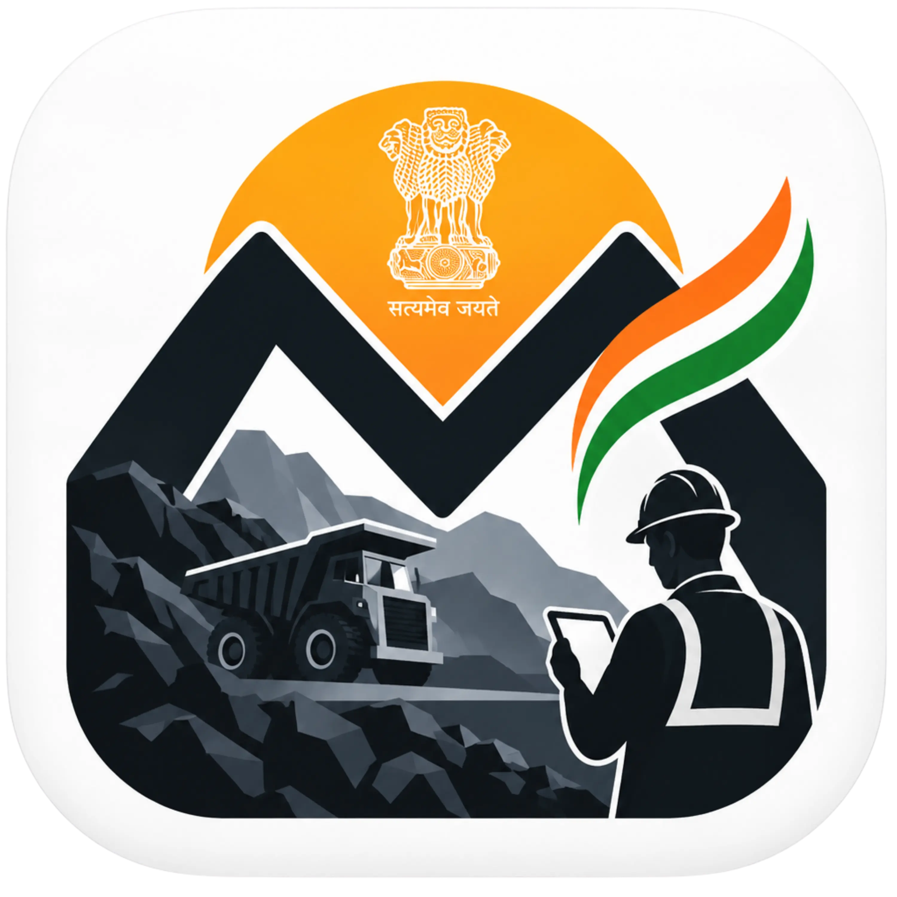
  <h1>🇮🇳 MineGOV — CoalMine Governance & Intelligence Platform</h1>

[](https://reactnative.dev/)
[](https://expo.dev/)
[](https://www.typescriptlang.org/)
[](https://supabase.com/)
[](https://ai.google.dev/)
[](https://dgms.gov.in/)
[](https://github.com/Ayushcodern/MIneGov/raw/main/releases/MineGov.apk)

</div>

> **Next-Generation Governance, Real-Time Compliance Audit, AI Hazard Forecasting & Offline-First Field Safety System for the Indian Coal Mining Sector.**

---

## 📌 Executive Summary

**MineGOV** is an enterprise-grade, mobile-first intelligence platform built to eliminate administrative silos and prevent underground and opencast coal mining hazards across Indian collieries. 

Built in alignment with statutory mandates of the **Directorate General of Mines Safety (DGMS)**, the **Coal Mines Regulations (CMR) 2017**, and the **Mines Act 1952**, MineGOV delivers real-time compliance enforcement, tamper-proof forensic evidence logging (SHA-256), AI-powered vision OCR in Hindi & English, geofenced inspection locking, dynamic coal consignment tracking via QR codes, and automated escalation governance.

---

## 📸 Application Screenshots & Showcase

| 1. Field Officer Dashboard & ESG Scorecard | 2. Step 1: GPS Geofence Verification | 3. Step 2: CMR 2017 Safety Checklist |
| :---: | :---: | :---: |
| 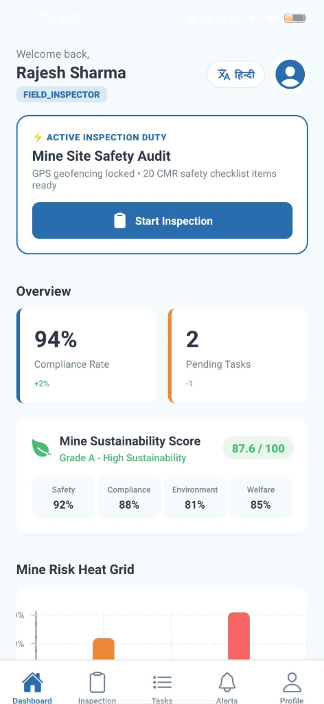 | 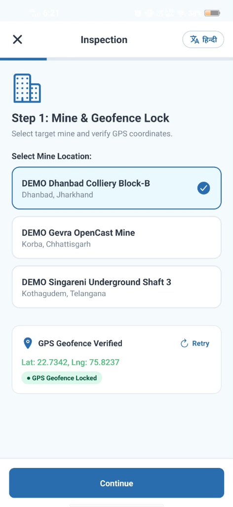 | 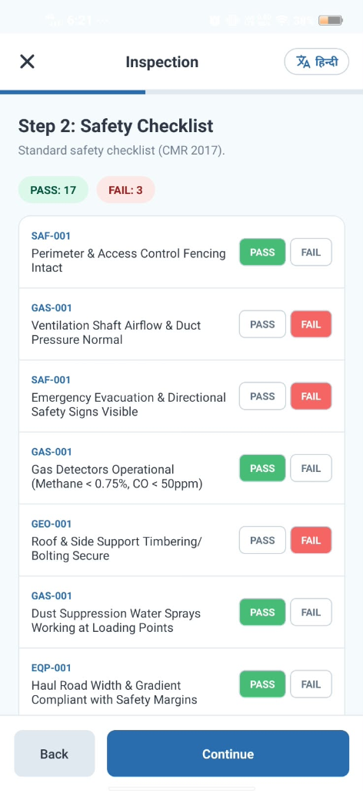 |
| *Active inspection duty, real-time ESG metrics (87.6/100), and Mine Risk Heat Grid* | *Mine location selection & real-time GPS boundary verification lock* | *20-point standard CMR 2017 safety checklist with instant Pass/Fail audit counters* |

| 4. Step 3: Multimedia Evidence & Bilingual OCR | 5. Officer Profile & Offline Sync Queue |
| :---: | :---: |
| 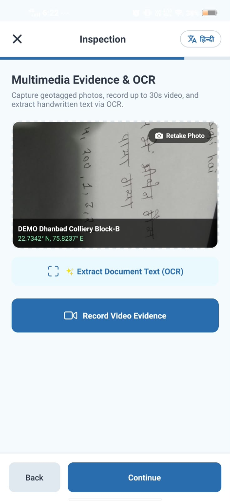 | 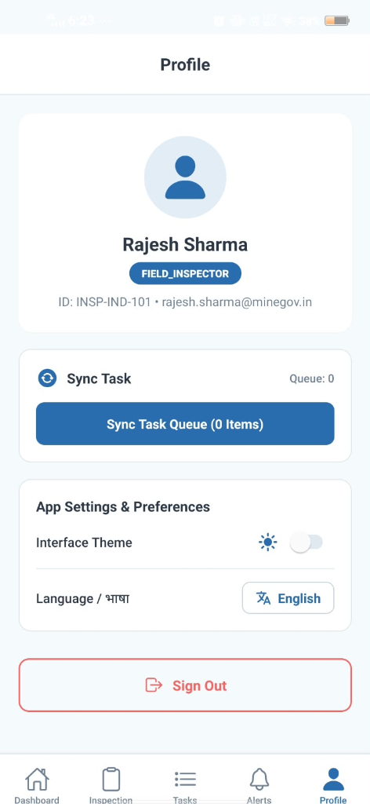 |
| *Geotagged coordinate stamp & Google Gemini AI bilingual handwritten log OCR* | *Officer authentication identity, offline task sync queue dispatcher, theme & language controls* |

---

## 🎥 Video Walkthrough & Live Demo

<!-- Embed your demonstration video here or link to YouTube / Loom -->

[](https://youtube.com)

> 📹 **Walkthrough Highlights:**
> - Zero-network underground inspection logging & background auto-sync.
> - Capturing handwritten Hindi/English shift logs and instant Gemini OCR text ingestion.
> - Dynamic Coal Consignment QR generation and Weighbridge shortage alert generation.
> - Multi-role switching across Field Inspector, Operations Manager, Compliance Officer, and DGMS Regulator.

---

## 🏗️ System Architecture & Module Interconnections

MineGOV is engineered with a **multi-tiered, offline-resilient, edge-to-cloud architecture** specifically designed for extreme underground mining environments with intermittent or zero network connectivity.

### 1. High-Level Layered System Architecture

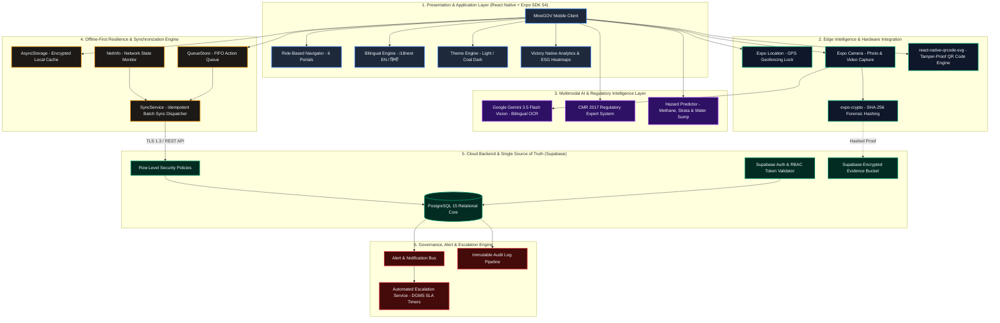

---

### 2. Detailed Module & Subsystem Interconnection Flow

The diagram below maps every functional TypeScript service to its respective screen components, data stores, and backend endpoints:

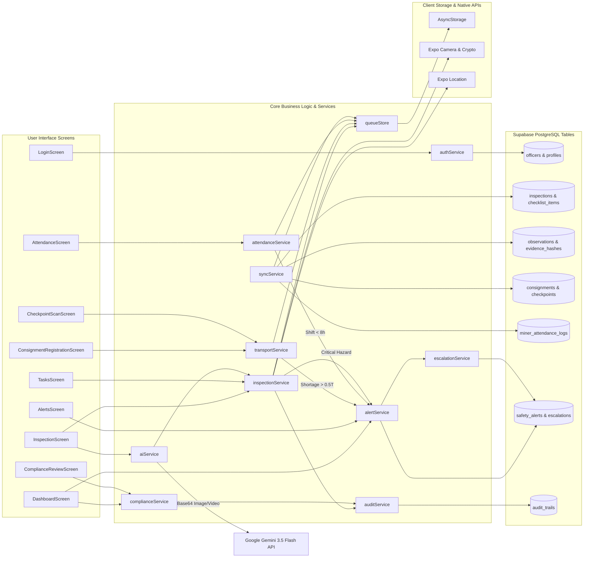

---

### 3. End-to-End Data Flow & Sequence Diagrams

#### A. Offline Underground Inspection & Background Replay Sync
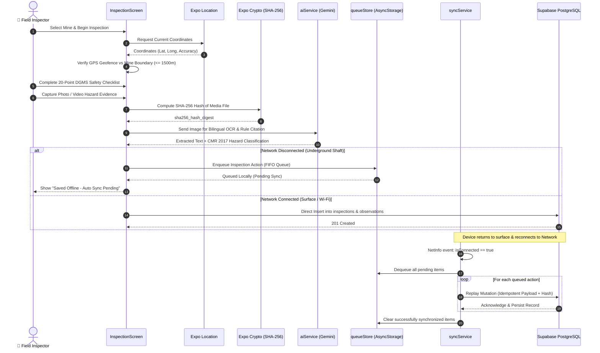

#### B. Coal Consignment Weighbridge Discrepancy & Anti-Theft Workflow
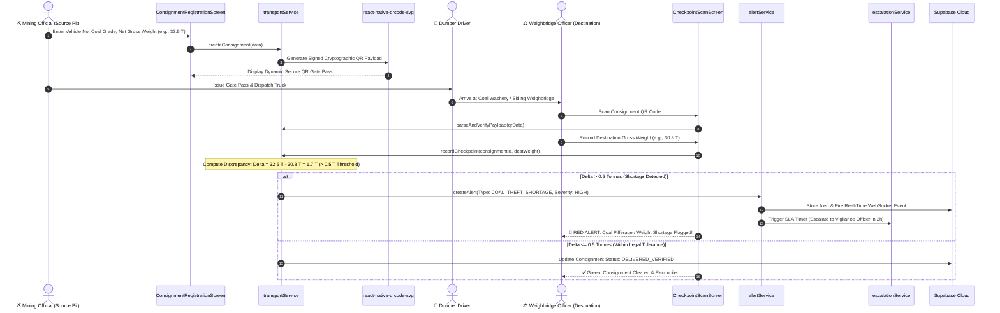

#### C. Miner Labour Gate Attendance & Statutory Shift Enforcement (Mines Act 1952)
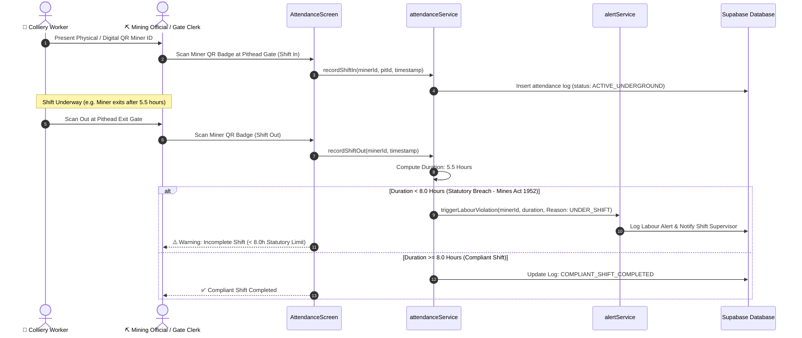

---

### 4. Comprehensive Module Interconnection & Interface Matrix

| Module Name | Key Source Files | Primary Inputs | Generated Outputs | Connected Modules | Communication Protocol |
| :--- | :--- | :--- | :--- | :--- | :--- |
| **Authentication & RBAC** | `authService.ts`, `LoginScreen.tsx`, `AppNavigator.tsx` | Badge ID, Password, Role | Auth Token, Session Object, Role Privileges | All Screens, `AppNavigator`, `Supabase Auth` | AsyncStorage + React Context |
| **Field Inspection & Audit** | `inspectionService.ts`, `InspectionScreen.tsx` | 20-Point Checklist, Mine GPS, Photos/Videos | Inspection Record, Hazard Score, Geo-Stamp | `aiService`, `queueStore`, `alertService`, `auditService` | TypeScript Direct Call + JSON Buffer |
| **Multimodal Vision AI** | `aiService.ts` | Media Base64 Strings, Shift Log Images | Bilingual OCR Text, CMR 2017 Citations, Risk Score | `inspectionService`, Google Gemini REST API | HTTPS REST (Generative Language API) |
| **Offline FIFO Queue & Sync** | `queueStore.ts`, `syncService.ts` | Offline Mutations, Network State (`NetInfo`) | Replayed DB Inserts/Updates, Sync Metrics | `inspectionService`, `transportService`, `attendanceService` | FIFO AsyncStorage Array + Supabase REST |
| **Coal Transport & Logistics** | `transportService.ts`, `ConsignmentRegistrationScreen.tsx`, `CheckpointScanScreen.tsx` | Coal Grade, Vehicle No, Gross/Tare Tonnage | Signed QR String, Weighbridge Delta, Theft Flag | `alertService`, `queueStore`, `auditService` | Cryptographic QR Payload + Supabase DB |
| **Miner Attendance & Welfare** | `attendanceService.ts`, `AttendanceScreen.tsx` | Miner Badge QR, Pithead Gate Timestamp | Shift Duration, Active Underground Count | `alertService`, `queueStore`, `Supabase DB` | Local Calculation + REST Replay |
| **Alerts & SLA Escalation** | `alertService.ts`, `escalationService.ts`, `AlertsScreen.tsx` | Anomaly Triggers (Theft, Hazard, Labour) | Tiered Alerts, Push Notifications, SLA Timers | `complianceService`, `DashboardScreen`, Supabase `safety_alerts` | WebSocket Realtime + Cron Dispatch |
| **ESG & Executive Dashboard** | `DashboardScreen.tsx`, `complianceService.ts` | Multi-mine Aggregated Metric Records | Sustainability Index (0-100), Heatmap Grids | `victory-native`, `complianceService`, `authService` | Relational SQL Aggregation Queries |
| **Forensic Audit Logging** | `auditService.ts` | Officer Action, Entity ID, Before/After Snapshot | Tamper-Proof Audit Record, Device Fingerprint | All Mutating Services, `audit_trails` Table | Write-Only Append Pipeline |

---

## 🛠️ Comprehensive Tech Stack

| Domain | Technology / Library | Purpose & Rationale |
| :--- | :--- | :--- |
| **Frontend Framework** | `React Native 0.74+` with `Expo SDK 54` | Cross-platform (Android, iOS, Web) native performance |
| **Language** | `TypeScript 5.0+` | End-to-end type safety and deterministic code execution |
| **Backend & Cloud DB** | `Supabase` (PostgreSQL) | Managed scalable relational database with RLS policies |
| **AI / Computer Vision** | `Google Gemini 3.5 Flash-Lite` | Zero-shot multilingual OCR, handwriting analysis & CMR citation |
| **Cryptographic Integrity** | `expo-crypto` | Strict SHA-256 hashing for photo/video tamper-evident audits |
| **Geospatial & Lock** | `expo-location` | Enforces GPS geofence proximity verification at pithead |
| **Offline Resilience** | `@react-native-async-storage` + NetInfo | Seamless offline queue execution for underground zero-reception mines |
| **Data Visualization** | `victory-native` | Interactive Mine Risk Heat Grids & ESG compliance trends |
| **QR Code Engine** | `react-native-qrcode-svg` | Real-time generation of digital transport and miner identity badges |
| **Localization** | `i18next` + `react-i18next` | Instant reactive switching between Hindi (हिन्दी) & English |
| **Export & Reporting** | `expo-file-system/legacy` + `expo-sharing` | On-device JSON/PDF generation for statutory DGMS inspection audits |

---

## 👥 6 Dedicated Officer Roles & Governance Portals

MineGOV automatically adapts UI workflows, privileges, and action cards based on the authenticated officer:

```
+---------------------------------------------------------------------------------------------------------+
|                                    MINEGOV GOVERNANCE HIERARCHY                                         |
+---------------------+-------------------------------+---------------------------------------------------+
| Role Designation    | Default Officer               | Core Responsibilities & Modules                   |
+---------------------+-------------------------------+---------------------------------------------------+
| 👮 Field Inspector   | Rajesh Sharma (INSP-IND-101)  | Live GPS Inspections, 20-item checklist, OCR, video |
| ⛏️ Mining Official   | Priya Nair (OFF-IND-202)      | Weighbridge QR scan, Shift attendance, Dispatch   |
| 🛡️ Compliance Officer| Sunita Deshmukh (COMP-IND-404)| Inspection report signoff, PPT rule matrices       |
| 🏗️ Contractor Lead  | Amit Verma (CONT-IND-303)     | Corrective task resolution (Inspection restricted)|
| 📊 Corporate ESG    | Vikram Malhotra (CORP-IND-505)| Multi-mine ESG scorecard, Risk heat grid analytics|
| 🏛️ DGMS Regulator   | Dr. Alok Kumar (DGMS-IND-606) | Statutory safety violation orders, audit exports  |
+---------------------+-------------------------------+---------------------------------------------------+
```

---

## ✨ Key Feature Highlights

### 1. 🌐 Instant Bilingual Localization (English & हिन्दी)
- Full app-wide translation encompassing all bottom tabs, navigation headers, checklist items, AI severity badges, and alert cards.
- Fast one-tap `EN / हिन्दी` switch in the header and profile settings.

### 2. 📄 Gemini AI Vision Document OCR
- Extract printed notices, daily safety shift logs, and handwritten observations in English or Hindi directly from photos or gallery uploads.
- Automatically inserts extracted text into field observation notes tagged `[AI-extracted, requires human review]`.

### 3. 📹 Forensic Multimedia Evidence (SHA-256)
- Geotagged photo capture with mine coordinate overlays.
- 30-second video evidence capture stamped with irreversible SHA-256 cryptographic hashes to prevent post-incident tampering.

### 4. 📶 Underground Offline-First Architecture
- Automatic detection of network disconnection (e.g. entering deep underground shafts).
- Field audits, checklists, and QR scans are queued into a local FIFO buffer and automatically synchronized to Supabase PostgreSQL upon returning to the surface.

### 5. 🚚 Digital Coal Logistics & Weighbridge QR Anti-Theft
- **Source Registration:** Creates cryptographically structured QR passes for coal dumpers.
- **Weighbridge Checkpoint Scan:** Validates gross tonnage at destination. Shortages exceeding `0.5 Tonnes` immediately trigger a **Coal Theft / Weight Deviation Alert**.

### 6. 👷 Miner Shift Attendance & Safety Law Enforcement
- QR gate check-in / check-out for underground miners.
- Automated shift duration tracking that fires **Labour Rule Violation Alerts** if a worker is recorded working less than the statutory 8.0-hour mandatory shift (*Mines Act 1952*).

### 7. 📊 Clean ESG Sustainability Scorecard
- Real-time rating (`Grade A - High Sustainability`) with sub-metric breakdowns across Safety (92%), Compliance (88%), Environmental (81%), and Welfare (85%).

---

## 🚀 Quick Start & Installation

### Prerequisites
- **Node.js**: `v18.0+`
- **npm** or **yarn**
- **Expo Go App** installed on your Android / iOS smartphone.

### Step 1: Clone Repository
```bash
git clone https://github.com/Ayushcodern/MIneGov.git
cd MIneGov/cm-gip-mobile
```

### Step 2: Install Dependencies
```bash
npm install
```

### Step 3: Configure Environment Variables
Create a `.env` file inside `cm-gip-mobile/`:
```env
EXPO_PUBLIC_SUPABASE_URL=https://<your-supabase-project>.supabase.co
EXPO_PUBLIC_SUPABASE_ANON_KEY=<your-supabase-anon-key>
EXPO_PUBLIC_GEMINI_API_KEY=<your-google-gemini-api-key>
```

### Step 4: Run the Application
```bash
# Clear Metro cache and launch Expo Dev Server
npx expo start -c
```
- Scan the printed QR code using the **Expo Go** mobile app.
- For Web Browser testing: press `w` or run `npm run web`.

---

## 🗄️ Database Schema & Seeding

The complete database schema is provided in [`supabase_schema.sql`](file:///d:/sihminegov/minegov/MineGOV/supabase_schema.sql).

To deploy:
1. Open your Supabase Project Dashboard -> **SQL Editor**.
2. Paste and run the contents of [`supabase_schema.sql`](file:///d:/sihminegov/minegov/MineGOV/supabase_schema.sql).
3. Paste and run [`seed_demo_officers.sql`](file:///d:/sihminegov/minegov/MineGOV/seed_demo_officers.sql) to initialize authentic Indian officer credentials.

---

## 🧪 Demo Credentials & Testing Matrix

**Universal Password for All Demo Accounts:** `Demo@1234`

| Role | Username / Badge ID | Official Email |
| :--- | :--- | :--- |
| **Field Inspector** | `RAJESH_INSPECTOR` (or `OFF-001`) | `rajesh.sharma@minegov.in` |
| **Mining Official** | `PRIYA_OFFICIAL` (or `OFF-002`) | `priya.nair@minegov.in` |
| **Compliance Officer** | `SUNITA_COMPLIANCE` (or `OFF-004`) | `sunita.deshmukh@minegov.in` |
| **Contractor Lead** | `AMIT_CONTRACTOR` (or `OFF-003`) | `amit.verma@apexheavy.in` |
| **Corporate ESG** | `VIKRAM_CORP` (or `OFF-005`) | `vikram.malhotra@cil.gov.in` |
| **DGMS Regulator** | `ALOK_REGULATOR` (or `OFF-006`) | `alok.kumar@dgms.gov.in` |

*(Tip: You can also use the one-tap **Quick Role Switcher Chips** directly on the Login screen!)*

---

## 📜 Statutory Standards & Regulatory Compliance

MineGOV is architected in accordance with statutory requirements established by the Ministry of Coal and DGMS:
- **Coal Mines Regulations (CMR) 2017:** Reg 141 (Ventilation & Inflammable Gas), Reg 54 (Signage & Access), Reg 108 (Strata Control & Support).
- **Mines Act 1952:** Section 28 & 30 (Mandatory Shift Durations & Labour Welfare).
- **DGMS Circulars on Digital Safety:** Forensic tamper-evident inspection logging & verifiable audit trails.

---

## 📄 License
This project is licensed under the **MIT License** — see the [LICENSE](LICENSE) file for details.

---

## 🤝 Acknowledgments
- **Ministry of Coal, Government of India**
- **Directorate General of Mines Safety (DGMS)**
- **Smart India Hackathon (SIH)**
